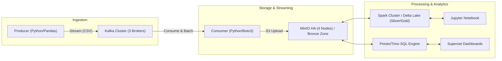

# 📡 TelcoDataFlowX: Real-Time Telco Data Pipeline

TelcoDataFlowX is a robust, distributed data architecture designed for streaming ingestion, high-availability storage, and large-scale analytics of telecommunications data. This project implements a modern Data Lakehouse architecture using the Medallion (Bronze/Silver/Gold) pattern on top of Delta Lake and MinIO.

---

## 🏗️ Architecture



### Key Components
- **Streaming Ingestion**: Apache Kafka (HA Cluster with 3 brokers) for reliable message buffering.
- **Micro-Batching**: Python-based Consumer that batches stream data into CSV files for long-term storage.
- **Data Lakehouse**: MinIO High-Availability (4 nodes) as S3-compatible storage, hosting Delta Lake tables.
- **Distributed Processing**: Apache Spark (Standalone Master/Worker) for ETL and Machine Learning (Spark ML).
- **SQL Analytics**: Presto/Trino for high-performance SQL queries over the data lake.
- **Visualisation**: Apache Superset for interactive business intelligence dashboards.

---

## 🛠️ Prerequisites

### Large JAR Files
To ensure full compatibility with Hadoop and S3 (MinIO), several JAR files are required. These are **not included** in the repository due to their size.

1.  **Create** a `jars/` directory at the root of the project.
2.  **Download** the following files into `jars/`:
    - [`aws-java-sdk-bundle-1.12.406.jar`](https://repo1.maven.org/maven2/com/amazonaws/aws-java-sdk-bundle/1.12.406/aws-java-sdk-bundle-1.12.406.jar)
    - [`aws-java-sdk-bundle-1.12.301.jar`](https://repo1.maven.org/maven2/com/amazonaws/aws-java-sdk-bundle/1.12.301/aws-java-sdk-bundle-1.12.301.jar)
    - [`hadoop-aws-3.3.6.jar`](https://mvnrepository.com/artifact/org.apache.hadoop/hadoop-aws/3.3.6)
    - [`hadoop-common-3.3.6.jar`](https://mvnrepository.com/artifact/org.apache.hadoop/hadoop-common/3.3.6)

---

## 🚀 Installation & Execution

The project uses automated scripts to manage the lifecycle of the various components.

### 1. Ingestion Pipeline (Kafka & MinIO)
To start the streaming infrastructure (Kafka brokers, MinIO nodes, Producer, and Consumer):
```bash
./pipeline_start_ingestion.sh
```
*Wait for health checks to pass. The producer will begin streaming data from `producer/data/dataset.csv`.*

### 2. Processing Layer (Spark & Notebooks)
To start the Spark Master, Workers, and Jupyter Notebook environment:
```bash
./pipeline_start_spark.sh
```
- **Jupyter Notebook**: Accessible at `http://localhost:8888` (Token: `spark123`)
- **Spark UI**: Accessible at `http://localhost:8080`

### 3. Testing High Availability (Optional)
To verify the resilience of the Kafka/MinIO clusters:
```bash
./test_ha.sh
```

### 4. Stopping the Project
To bring down all services and clean up resources:
```bash
./pipeline_stop_all.sh
```

---

## 📁 Project Structure

```text
.
├── consumer/           # Kafka Consumer (Python/Boto3)
├── producer/           # Kafka Producer (Python/Pandas)
├── spark/              # Spark configuration and Notebooks
│   ├── app/            # Jupyter Notebooks and application code
│   └── conf/           # Spark Site and Default configurations
├── jars/               # (Manual) External dependencies
├── docker-compose.yaml # Service orchestration
├── .env                # Environment variables
└── pipeline_*.sh      # Automation scripts
```

---

## 📧 Contact
For any questions regarding this project, please contact:
**Akram Haggui** - [akramhaggui2@gmail.com](mailto:akramhaggui2@gmail.com)
